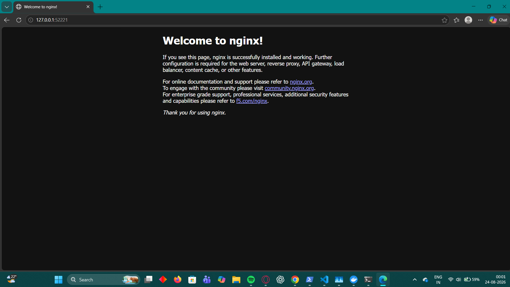
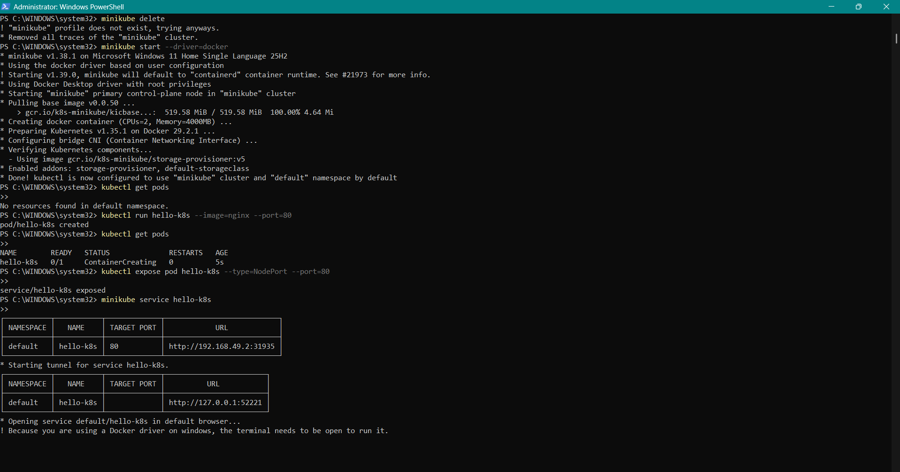

# Exercise 1 — Kubernetes Getting Started

## Final Result

The Nginx application was successfully deployed as a Kubernetes Pod using Minikube and accessed through a Kubernetes Service.

---

## Commands Executed

The following commands were executed in Windows PowerShell to create the Minikube cluster, deploy the Nginx Pod, verify its status, expose it as a service, and access the application.

