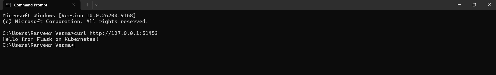
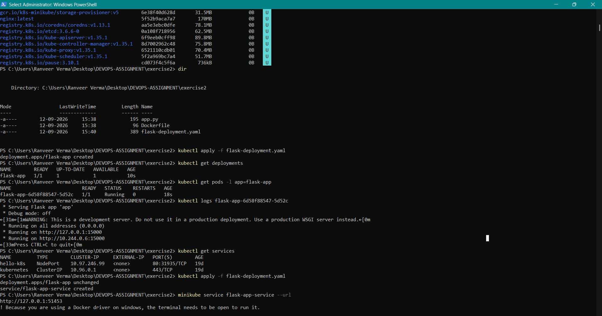

# Exercise 2 — Deploy a Flask App on Minikube using Kubernetes

## Final Result

The Flask application was successfully deployed as a Kubernetes Deployment and Pod using Minikube, exposed through a Kubernetes Service, and accessed successfully from the Windows command prompt.



---

## Commands Executed

The following commands were executed in Windows PowerShell to start the Minikube cluster, build the Flask Docker image, deploy the application to Kubernetes, verify the Deployment and Pod, create a Kubernetes Service, and obtain the service URL.



---

## Application Output

The Flask application was successfully accessed through the Minikube service and returned:

```text
Hello from Flask on Kubernetes!