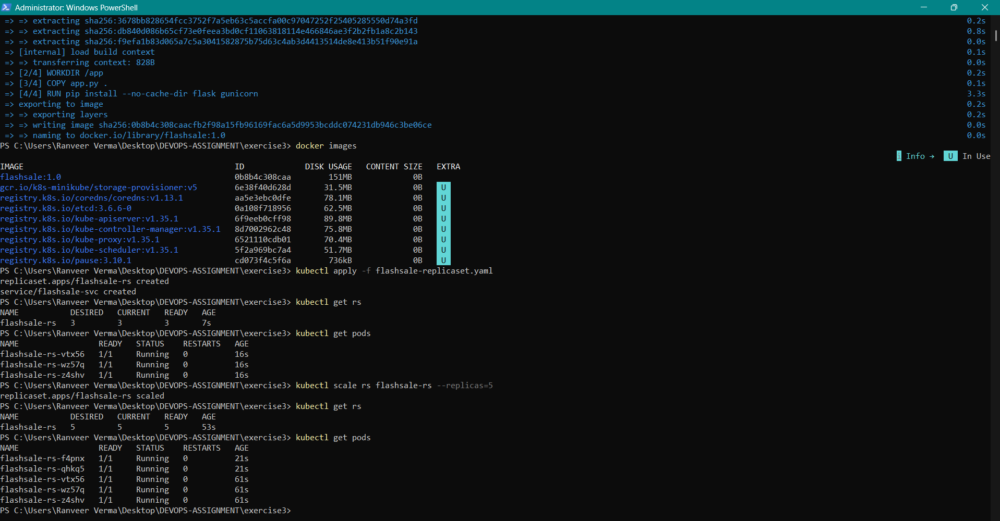

# Exercise 3 — Scaling Flask App on Single Node using ReplicaSets

## Final Result

The Flask Flash Sale application was successfully deployed on a single-node Minikube cluster using a Kubernetes ReplicaSet.

The application was initially deployed with **3 replicas** and was successfully scaled to **5 replicas**. All 5 Pods were running and ready after scaling.

---